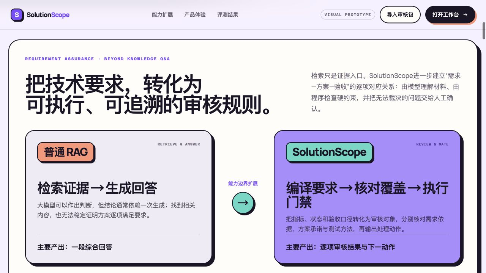
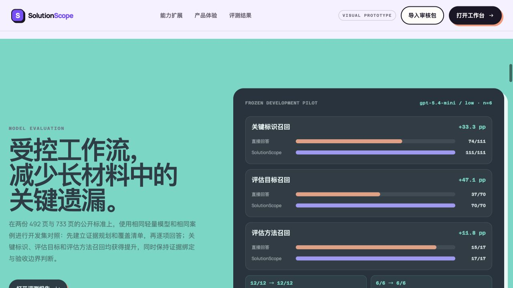
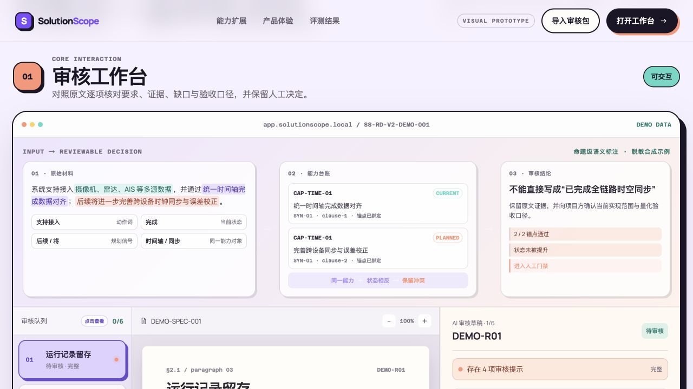
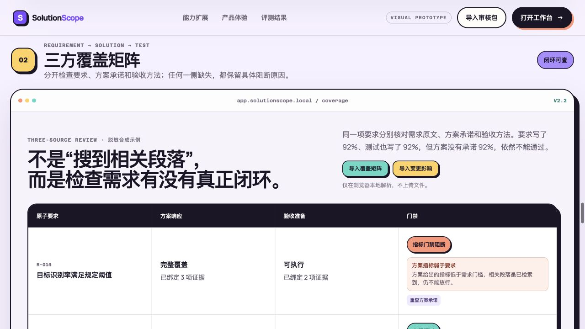
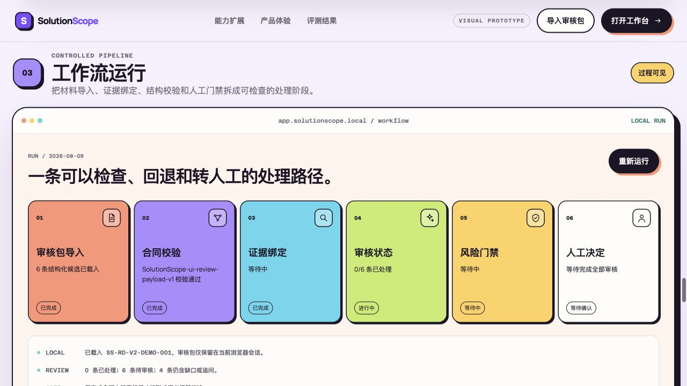
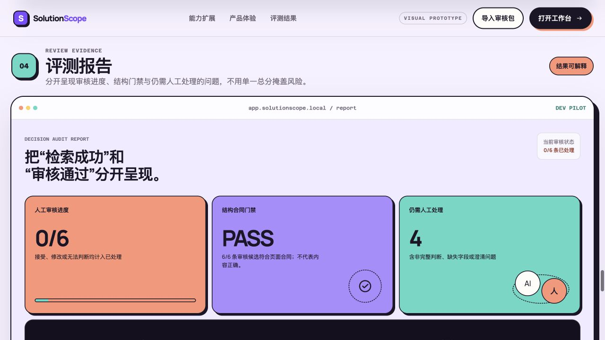

# SolutionScope

> 复杂技术材料的可追溯审查、验收门禁与要求变更影响工作台。当前深化版本：`v2.2`。

SolutionScope 针对技术材料中“要求写了、方案提了、验收也有安排，但三者并未真正对齐”的审核问题。它不直接代替专家下结论，而是把来源要求、方案响应和验收方法逐项关联；当要求发生修改、拆分或合并时，冻结旧结论并生成复核任务，避免历史覆盖状态被静默沿用。

## 在线体验

[打开在线产品演示 →](https://saintjupiter.github.io/SolutionScope/)

[直接进入审核工作台](https://saintjupiter.github.io/SolutionScope/#product) · [查看公开前端文件](docs/)

在线页面使用脱敏合成数据，集中展示三方材料对齐、证据定位、指标门禁、冲突保留与人工审核流程。


## 能力扩展：从检索回答到逐项审核

SolutionScope 将材料中的相关证据继续编译为**要求原子、三方覆盖关系、确定性门禁与人工复核动作**。模型负责理解与结构化，程序负责状态、单位和阈值判断，人工负责材料无法裁决的真实口径。

最终产出从一段综合回答扩展为：逐项审核状态、原文依据、阻断原因和下一动作。例如，需求规定最低指标、验收也给出通过口径，但方案只写“支持该能力”而未承诺最低指标时，系统会将其判为覆盖不足并生成复核动作。

当前可审核的能力包括：

1. 每项要求包含哪些动作、条件和量化指标；
2. 方案材料是否逐项作出响应，而不是只出现相关术语；
3. 验收材料是否同时给出可执行方法与明确判定口径；
4. 规划中的能力能否在当前阶段计入覆盖；
5. 哪些要求可以凭证据放行，哪些必须阻断或转人工。
6. 要求版本发生变化后，哪些方案承诺、验收方法和放行结论必须重新确认。
7. 方案和验收口径中的数值、单位与上下限，是否真的满足要求，而不是只看语义相关。

要求、方案和验收证据具有不同角色，不能互相替代。模型只负责逐组件判断，最终覆盖状态、放行结论和变更复核任务由确定性规则派生。可先阅读精简的 [`v2.2 功能说明`](docs/v2-2-product-capability-brief.md)，完整设计与案例见 [`产品深化说明`](docs/v2-rag-boundary-and-product-deepening.md)。

## 核心产品判断

1. **结构通过不等于内容正确**：结构、证据和语义风险分层检查，不用一个总分掩盖错误类型。
2. **“提到了”不等于“覆盖了”**：要求动作、适用条件和量化指标分别核对；不能用相关术语或验收计划替方案补写能力。
3. **证据角色不可混用**：要求、方案和验收材料分别登记，引用只能证明所属角色的事实。
4. **状态和放行结论不由模型自由生成**：生命周期状态、组件完整性和验收可执行性进入确定性门禁。
5. **不自动裁决真实口径**：如材料同时宣称“已实现”与“后续完善”，保留冲突并关闭人工放行门禁。
6. **旧结论不能跨版本沿用**：要求被修改、拆分、合并、增加或删除时，自动冻结受影响项并生成三方复核清单。
7. **相关段落不等于指标达标**：模型只抄录材料实际写出的指标；程序统一单位并比较阈值，发现方案承诺偏弱、验收阈值错误或指标对象不一致时直接阻断。

## v2.2 当前闭环

```text
要求材料 / 方案材料 / 验收材料
  → 分角色来源单元（页码 / 章节 / 段落）
  → 要求原子化（动作 / 条件 / 指标 / 验收口径）
  → 混合候选检索（词项 / 指标 / 状态 / 短语 / 邻段）
  → 方案覆盖与验收可执行性逐组件判断
  → 单位换算 / 阈值比较 / 生命周期等确定性门禁
  → 覆盖矩阵 / 缺口清单 / 人工审核包

旧版要求原子 ─┐
新版要求原子 ─┴→ 语义对齐与变更分类 → 方案 / 验收复核清单 → 变更确认前冻结放行
```

## 可运行产物

| 产物 | 路径 | 用途 |
| --- | --- | --- |
| 当前深化版 Skill | `skill/solutionscope-v2-2/` | 三方覆盖审查、数值与状态门禁、要求变更影响 |
| v2.2 指标门禁冒烟测试 | `evaluation/v2-2-invariant-smoke/` | 弱于需求的方案指标被阻断、等价单位换算不误报 |
| v2.1 工程自测 | `evaluation/v2-1-three-source-smoke/` | 伪覆盖阻断、92%→95% 变更冻结与复核清单 |
| 公平 RAG 对照协议 | `evaluation/v2-1-fair-rag-comparison/` | 同输入、同模型、同预算的对照与外部表述门槛 |
| v2 设计边界 | `docs/v2-rag-boundary-and-product-deepening.md` | 与普通 RAG 的实质差异、已实现机制及未验证边界 |
| v2.2 功能说明 | `docs/v2-2-product-capability-brief.md` | 实际问题、核心能力、RAG 边界与最小例子 |
| 旧版当前入口 | `skill/solutionscope/` | 单文档离线准备、登记、校验、组装和报告链路 |
| 审核决策原型 | `prototype/review-decision-v2/` | 本地审核、三层门禁、决策卡导出 |

## 产品演示：按实际审核顺序浏览

### 01 · 产品场景

从技术方案、可研与验收材料中的真实审核问题切入。


### 02 · 能力扩展

从“检索证据并回答”扩展到“编译要求、核对覆盖并执行门禁”。



### 03 · 效果验证

在相同轻量模型、相同冻结案例下，分别展示关键标识、评估目标和评估方法的召回变化。



### 04 · 审核工作台

对照原文、AI 草稿和结构化字段，逐项接受、修改或转人工判断。



### 05 · 三方覆盖矩阵

分别核对需求要求、方案承诺与验收方法，避免相关材料互相替代。



### 06 · 工作流运行

展示导入、证据规划、结构校验、规则门禁和人工复核的处理过程。



### 07 · 审核报告

分开呈现审核进度、门禁结果、风险项与下一动作。



## 快速检查

```bash
cd skill/solutionscope-v2-2
python3 scripts/coverage_workflow.py self-test

cd skill/solutionscope
python3 -m unittest discover -s scripts/tests -v
python3 scripts/tests/smoke_test.py

cd ../../prototype/review-decision-v2
node smoke_test.js
python3 -m http.server 8000
```

打开 `http://localhost:8000/index.html` 可使用脱敏合成 fixture 演示，也可导入 Skill 运行后生成的 `final/ui_review_payload.json`。页面不调用模型；导入包仅保留在当前浏览器会话，不会上传。

## 已验证的有限证据

- **v2.2 / 确定性指标门禁冒烟测试**：即使模型把较弱的方案承诺标记为“完整覆盖”，程序仍会依据要求原文阻断；对 `600 ms` 与 `0.6 s` 这类等价口径则先换算再判断，避免机械误报。该测试只验证核心门禁按设计工作，不是模型准确率实验。

- **v2.1 / 三文档与变更影响工程自测**：要求、方案和验收材料分别登记；当验收计划包含阈值而方案未承诺阈值时，系统仍阻断放行。识别率要求由 92% 提升至 95% 后，旧放行状态不会沿用，并生成方案、验收及人工确认的复核任务。该结果只证明门禁和变更机制按设计运行。

- **v1.1 / 单一来源族 20 个开发项**：直接草稿严格合同错误 37；Skill 首轮 1；一次机器反馈后 0。但最终将参考集中 18/20 个非完整项判为 `complete`，因此只证明合同整治，不证明语义更准。
- **v1.4 / 单一开发材料 6 题**：同一 `gpt-5.4-mini / low` 设置下，直接组为 1 次调用，Skill 组为 3 次调用；“未来/候选被写为当前”的来源约束风险标记为 8 → 0，材料自身时间轴冲突仍保留 1 项给人工。这是描述性来源风险观察，不是准确率或等成本性能结论。
- **v1.5 / 独立合成前向测试**：在新的低温药品试验舱配置上，干净链路 0 结构错误、0 确定性来源风险；非法定位与未知能力 ID 均强制拒绝且不产生最终件；未登记的状态冲突被写入最终 `review_gate`并关闭人工放行门禁。这是工程前向检查，不是保留集或泛化证据。

## 安全与边界

- 原始模型输出登记后不改写；不可得的耗时、Token 和成本保留为 `unavailable`。
- 结构错误 fail closed；确定性来源风险进入 `review_gate`并关闭人工放行门禁。进程退出码 0 只代表已生成可审计产物，不代表已批准放行。
- 项目不声称专家金标、准确率提升、跨场景泛化、生产落地、用户效率或 ROI。
- 本地受限材料及原始输出不进入公开仓库。公开演示只用脱敏合成数据。

## 下一步深化

1. 扩充常用量纲与指标别名，但不把无法比较的单位强行换算。
2. 将数值门禁、状态冲突和要求变更复核直接呈现在审核工作台。
3. 用少量真实材料做回归案例，优先检查是否错误放行，不追求论文式大规模评测。

当前产品能力、技术边界和下一步计划分别见 [`v2.2 功能说明`](docs/v2-2-product-capability-brief.md) 与 [`产品深化说明`](docs/v2-rag-boundary-and-product-deepening.md)。
