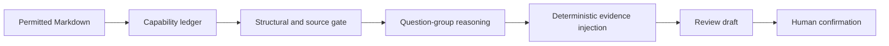

# SolutionScope

SolutionScope is a Codex Skill for reviewing long technical materials without
mixing current capabilities, future plans, candidate ideas, and normative
requirements.

It first builds a source-anchored capability ledger. Question-specific model
calls may then select only ledger IDs; lifecycle state and exact evidence are
injected deterministically during assembly. The result is a review draft with
traceable evidence, explicit gaps, and preserved conflicts.



## What it demonstrates

- lifecycle-aware extraction: `current`, `planned`, `candidate`, `normative`,
  `unknown`, and `conflicted`;
- exact page/section/paragraph/quote binding;
- schema-constrained model outputs and fail-closed validation;
- small-group reasoning over stable capability IDs;
- deterministic assembly and review-oriented risk reporting;
- explicit separation between structural validity and semantic correctness.

## Repository layout

```text
skill/solutionscope/
├── SKILL.md
├── agents/openai.yaml
├── references/semantic-contract.md
└── scripts/ledger_constrained_workflow.py
examples/
├── synthetic-platform.md
└── questions.json
tests/
└── test_workflow.py
```

The public repository contains only code and synthetic material. Original
project documents, restricted excerpts, prompts containing them, and model run
artifacts are intentionally excluded.

## Install as a Codex Skill

Copy `skill/solutionscope` into your Codex skills directory:

```bash
cp -R skill/solutionscope ~/.codex/skills/solutionscope
```

Then invoke it with `$solutionscope` and a permitted technical document.

## Deterministic workflow

The script uses only the Python standard library. It prepares model request
packages but does not call a provider itself, so the caller controls which model
receives the document.

```bash
SCRIPT=skill/solutionscope/scripts/ledger_constrained_workflow.py
RUN=/tmp/solutionscope-demo

python3 "$SCRIPT" init \
  --input examples/synthetic-platform.md \
  --questions examples/questions.json \
  --run-dir "$RUN" \
  --run-id demo-001 \
  --model your-model

python3 "$SCRIPT" prepare-ledger --run-dir "$RUN"
```

Use `ledger_request.json` and its declared JSON schema for one model call, save
the raw result to `ledger_raw.json`, and continue with:

```bash
python3 "$SCRIPT" register-ledger \
  --run-dir "$RUN" \
  --artifact "$RUN/ledger_raw.json" \
  --model-call-id ledger-01

python3 "$SCRIPT" validate-ledger --run-dir "$RUN"
python3 "$SCRIPT" prepare-fragment --run-dir "$RUN" --question-ids Q1,Q2,Q3
```

Repeat registration and validation for each question group, then run
`assemble` and `validate-final`. See `SKILL.md` for the complete agent workflow.

## Evaluation boundary

An internal same-material, same-model development pilot observed that the
source-risk flag “future or candidate capability promoted to current” changed
from 8 cases in a direct baseline to 0 with the ledger-constrained workflow.
One document-state conflict remained and was retained for human confirmation.

This was a single development document with six questions, and the workflow
used more model calls than the baseline. It is a descriptive risk comparison,
not an accuracy, expert-agreement, or generalization claim. Restricted pilot
artifacts are not published.

## Test

```bash
python3 -m unittest discover -s tests -v
python3 ~/.codex/skills/.system/skill-creator/scripts/quick_validate.py \
  skill/solutionscope
```

## License

MIT
