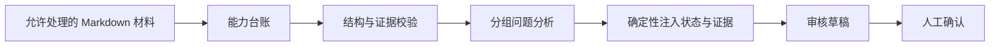

# SolutionScope

SolutionScope 是一个面向复杂技术材料的 Codex Skill，用于区分材料中的现有能力、后续规划、候选构想与规范性要求，避免模型在分析时混淆不同状态。

工作流首先构建带有原文证据的能力台账；随后，模型只能基于台账中的能力 ID 回答具体问题，生命周期状态与证据位置则在组装阶段确定性注入。最终产物是一份证据可追溯、信息缺口明确、保留冲突项的人工审核草稿。



## 核心能力

- 区分 `current`、`planned`、`candidate`、`normative`、`unknown` 和 `conflicted` 六类生命周期状态；
- 将事实字段绑定至页码、章节、段落和原文引用；
- 使用 Schema 约束模型输出，并在校验失败时拒绝继续组装；
- 将复杂问题拆分为小组任务，并统一引用稳定的能力 ID；
- 在最终组装阶段确定性注入状态与证据，减少跨问题不一致；
- 明确区分“结构校验通过”与“内容语义正确”，保留人工审核环节。

## 仓库结构

```text
skill/solutionscope/
├── SKILL.md
├── agents/openai.yaml
├── references/semantic-contract.md
└── scripts/ledger_constrained_workflow.py
examples/
├── synthetic-platform.md
└── questions.json
tests/
└── test_workflow.py
```

公开仓库仅包含代码和合成示例。真实项目材料、受限摘录、包含原文的提示词及模型运行记录均未上传。

## 安装为 Codex Skill

将 `skill/solutionscope` 复制到 Codex Skill 目录：

```bash
cp -R skill/solutionscope ~/.codex/skills/solutionscope
```

之后可以在 Codex 中通过 `$solutionscope` 调用，并提供一份已获准处理的技术材料。

## 工作流程

脚本仅依赖 Python 标准库。它负责生成模型请求包、校验输出和组装结果，但不会自行调用任何模型服务，因此使用者可以自行控制材料被发送至哪个模型。

```bash
SCRIPT=skill/solutionscope/scripts/ledger_constrained_workflow.py
RUN=/tmp/solutionscope-demo

python3 "$SCRIPT" init \
  --input examples/synthetic-platform.md \
  --questions examples/questions.json \
  --run-dir "$RUN" \
  --run-id demo-001 \
  --model your-model

python3 "$SCRIPT" prepare-ledger --run-dir "$RUN"
```

使用 `ledger_request.json` 及其指定的 JSON Schema 完成一次模型调用，并将原始结果保存为 `ledger_raw.json`，随后执行：

```bash
python3 "$SCRIPT" register-ledger \
  --run-dir "$RUN" \
  --artifact "$RUN/ledger_raw.json" \
  --model-call-id ledger-01

python3 "$SCRIPT" validate-ledger --run-dir "$RUN"
python3 "$SCRIPT" prepare-fragment --run-dir "$RUN" --question-ids Q1,Q2,Q3
```

对各问题组依次完成模型输出登记与校验，最后运行 `assemble` 和 `validate-final`。完整的 Agent 执行流程见 `SKILL.md`。

## 评测边界

在一次同材料、同模型的内部开发集对照中，直接回答基线出现了 8 项“将规划或候选能力误判为现有能力”的风险标记；引入能力台账约束后，该项风险标记降至 0。材料中仍有 1 项状态冲突被保留并转交人工确认。

该结果仅来自单份开发材料和 6 个问题，且工作流使用的模型调用次数多于直接回答基线。因此，它只能作为描述性的风险对比，不能解释为准确率、专家一致性或泛化能力提升。相关受限材料和运行原件不在本仓库公开。

## 测试

```bash
python3 -m unittest discover -s tests -v
python3 ~/.codex/skills/.system/skill-creator/scripts/quick_validate.py \
  skill/solutionscope
```

## 开源协议

MIT License
