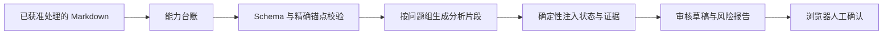
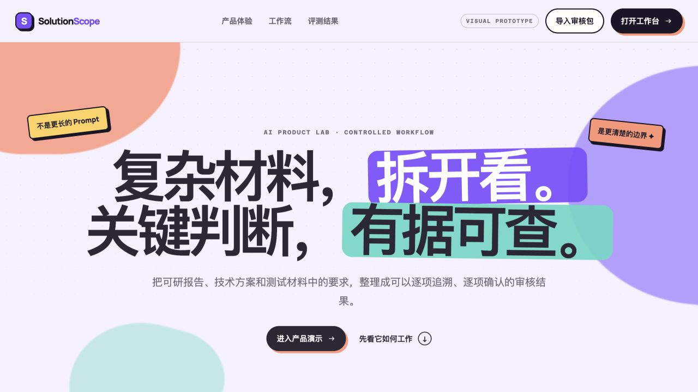
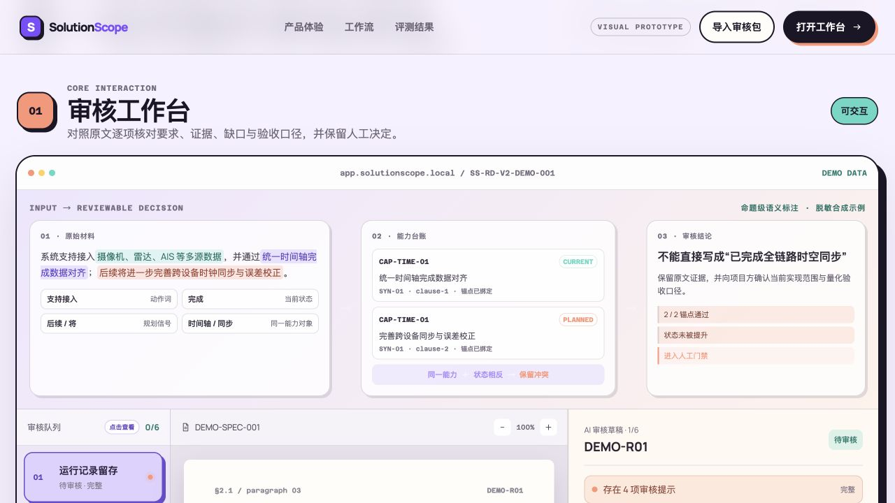
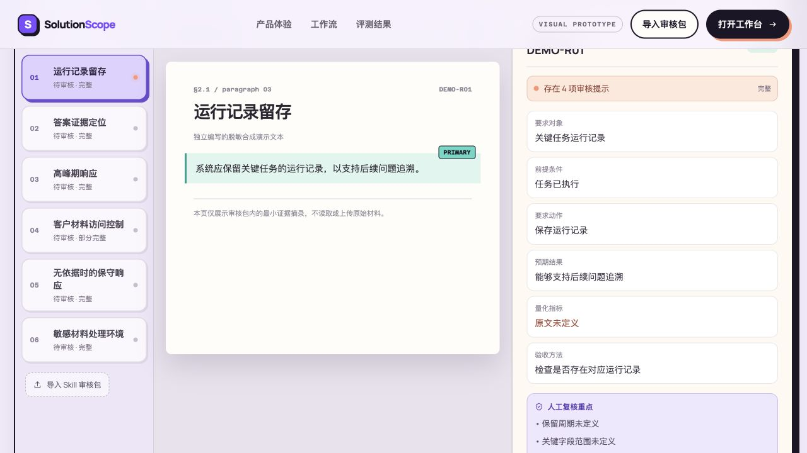

# SolutionScope

面向技术方案评审与验收准备的证据约束审核工作台。它把散落在可研报告、技术方案和测试材料中的要求，整理成**结构化要求、原文证据、信息缺口与状态冲突**，让审核者可以逐项追溯和确认。

## [打开在线产品演示 →](https://saintjupiter.github.io/SolutionScope/)

[直接查看审核工作台](https://saintjupiter.github.io/SolutionScope/#product) · [下载合成示例审核包](demo/sample-ui-review-payload.json)

> 在线页面仅演示交互。导入的 JSON 只保存在当前浏览器会话，不上传材料，也不调用模型。

## 使用场景

方案人员、项目负责人和测试评审人员经常需要在长篇材料中确认：一项能力究竟是**已经支持、计划建设，还是尚未定义验收口径**。同一结论的条件和证据可能分散在不同章节，人工逐页核对耗时，普通摘要又容易省略来源、混淆状态。

SolutionScope 将这项工作拆成一条可检查的路径：

1. 导入已经获准处理的技术材料；
2. 识别要求、能力状态、量化指标和验收方法；
3. 为事实字段绑定页码、章节、段落与原文引用；
4. 将缺口、冲突和无法判断项交给人工确认；
5. 保留审核决定与阶段性评测结果。

## 它解决什么问题

普通长文档问答容易把“计划建设”“可考虑加入”等描述写成已经具备的能力，也容易给出没有原文依据的结论。SolutionScope 将这类风险拆成三层控制：

- **结构层**：用 JSON Schema 固定输出合同，缺字段或形态错误时拒绝组装；
- **证据层**：每项事实绑定页码、章节、段落 ID 和原文引用；
- **语义风险层**：保留生命周期冲突、无依据陈述、信息缺口和待确认问题，不替人工做最终裁决。



## 当前能力

- 通过配置文件定义问题、问题组、生命周期短语和关注词，不把单一行业逻辑写死在代码中；
- 生成隔离的台账请求包与分组分析请求包，工作流自身不调用外部模型；
- 登记模型原始输出并保留哈希，不在校验后偷偷改写原件；
- 校验 Schema、精确来源锚点、能力 ID 和指令覆盖；
- 确定性组装 JSON/Markdown 审核草稿，并导出 `ui_review_payload.json`；
- 在静态审核页面中导入审核包，逐项接受、修改或标记无法判断，并形成阶段决策卡。

## 产品界面

### 1. 产品首页



### 2. 材料与证据审核



### 3. 人工审核工作台



## 快速开始

### 1. 安装为 Codex Skill

```bash
cp -R skill/solutionscope ~/.codex/skills/solutionscope
```

在 Codex 中通过 `$solutionscope` 调用，并提供已获准处理的 Markdown 材料。完整约束见 [SKILL.md](skill/solutionscope/SKILL.md)。

### 2. 准备一次运行

脚本只依赖 Python 标准库。下面的命令使用仓库内的公开合成材料，不会调用模型：

```bash
python3 skill/solutionscope/scripts/solutionscope_workflow.py prepare \
  --input examples/synthetic-platform.md \
  --config examples/workflow-config.json \
  --run-dir /tmp/solutionscope-demo \
  --run-id public-demo-001
```

随后在隔离的模型上下文中完成台账和各问题组输出，再用 `advance`、`complete` 或 `run-offline` 登记、校验并组装。成功通过最终结构门禁后，运行目录会生成：

```text
final/review_draft.json
final/review_draft.md
final/ui_review_payload.json
reports/source_constraint_risk_report.json
```

### 3. 打开审核页面

```bash
python3 -m http.server 8000 --directory demo
```

访问 `http://localhost:8000`，点击“导入审核包”，选择 `final/ui_review_payload.json`。也可以直接导入仓库中的 [合成示例审核包](demo/sample-ui-review-payload.json)。

## 仓库结构

```text
skill/solutionscope/
├── SKILL.md
├── agents/openai.yaml
├── references/
└── scripts/
    ├── solutionscope_workflow.py
    ├── schema_gate.py
    └── tests/
demo/                       # 本地开发用静态审核工作台
docs/                       # GitHub Pages 发布副本与截图
examples/                   # 公开合成材料与工作流配置
```

## 测试

```bash
cd skill/solutionscope
python3 -m unittest discover -s scripts/tests -v
python3 scripts/tests/smoke_test.py

cd ../../demo
node smoke_test.js
node --check app.js
node --check payload.js
node --check state.js
```

当前包含 **23 项 Python 确定性测试**，覆盖配置校验、来源锚点、生命周期、问题分组、组装、风险标记与 UI 审核包导出。

## 已验证结果与边界

在一次同材料、同模型的内部开发样本对照中，直接回答基线出现 8 项“将规划或候选能力写成现有能力”的风险标记；引入能力台账约束后，该项风险标记降至 0，另有 1 项材料自身的状态冲突被保留并转交人工确认。

这只是**单份开发材料、6 个问题的描述性风险对比**，且工作流使用 3 次模型调用，直接基线使用 1 次。它不能被解释为准确率、专家一致性、泛化能力或业务 ROI 提升。结构门禁通过同样不代表内容已经正确或获批。

公开仓库只包含代码、合成示例与合成截图。真实项目材料、受限摘录、包含原文的模型请求和运行记录均未上传。

## 开源协议

[MIT License](LICENSE)
