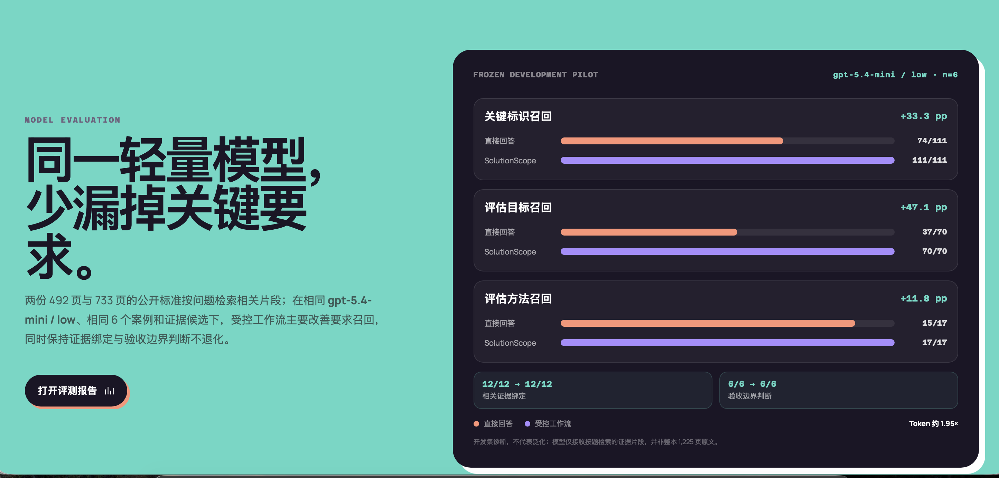

# 开发集对照：证据规划为什么减少漏项

## 结论

在同一 `gpt-5.4-mini / low`、同一冻结证据池和 6 个开发案例下，SolutionScope 的两阶段工作流主要提升了**长清单的完整召回**：

| 指标 | 单次直接回答 | SolutionScope | 变化 |
|---|---:|---:|---:|
| 关键标识召回 | 74/111（66.7%） | 111/111（100.0%） | **+33.3 pp** |
| 组织自定义参数召回 | 22/24（91.7%） | 24/24（100.0%） | **+8.3 pp** |
| 评估目标召回 | 37/70（52.9%） | 70/70（100.0%） | **+47.1 pp** |
| 评估方法召回 | 15/17（88.2%） | 17/17（100.0%） | **+11.8 pp** |
| 相关证据绑定 | 12/12（100.0%） | 12/12（100.0%） | 0 pp |
| 验收边界判断 | 6/6（100.0%） | 6/6（100.0%） | 0 pp |

资源开销由 21,393 tokens 增至 41,795 tokens，约为 **1.95×**。

## 为什么会提升

1. **单次回答容易主动压缩。** 面对带有多级编号和大量子项的技术材料，模型往往先形成摘要，再组织答案；主结论仍然正确，但细粒度标识、目标和方法会在压缩过程中遗漏。
2. **先规划证据，减少无关内容竞争。** SolutionScope 先从每题的候选材料中选择足够且相关的证据，再进入回答阶段，避免模型同时完成检索、取舍、归纳和写作。
3. **覆盖清单把“有没有写全”显式化。** 关键标识和评估对象被保存为待处置项；回答阶段必须逐项引用、说明限制或转人工，不能仅靠流畅叙述掩盖缺口。
4. **结构化输出降低低阶模型的自由度。** 每类事实、证据和验收边界有固定位置，模型更像完成可检查任务，而不是自由撰写摘要。

因此，更准确的表述是：

> SolutionScope 没有让模型普遍变得更聪明，而是通过证据规划和覆盖约束，把容易压缩遗漏的直接回答，改造成更完整、可追溯的要求清单。

## 对照设计与边界

- 样本：公开标准材料中的 6 个冻结开发案例；每题包含 2 条相关证据和 2 条干扰证据。
- A 组：获知相同基本规则的单次直接回答。
- B 组：证据规划 + 受约束回答，两次模型调用。
- 人工接管指标未进入主结论，因为两组提示对澄清问题的要求不同。
- 本结果仅为 `DEV / n=6` 的机制验证，不代表保留集表现、专家一致性、泛化能力或业务 ROI。
- 证据绑定和验收边界在 A 组已经满分，不能声称 SolutionScope 在这些指标上继续提升。

